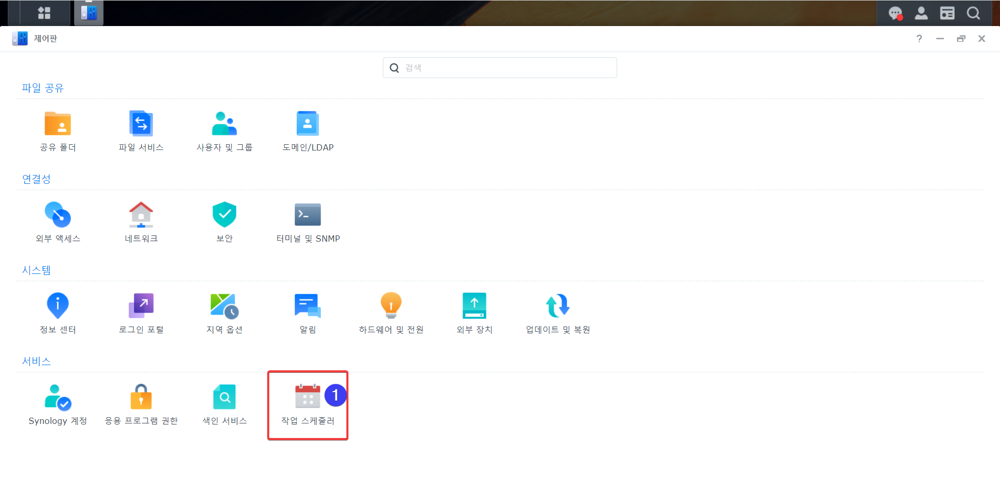
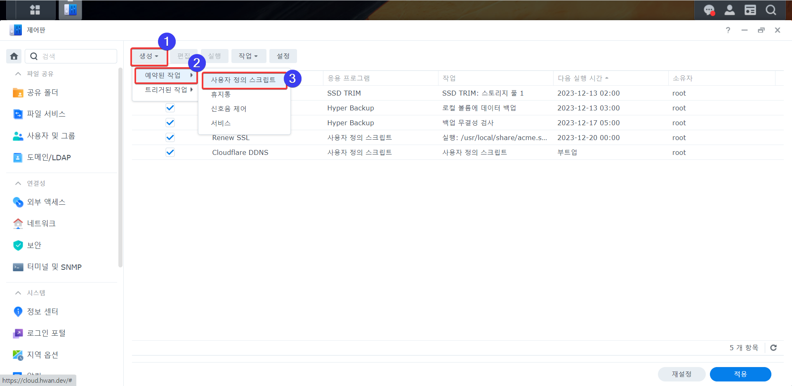
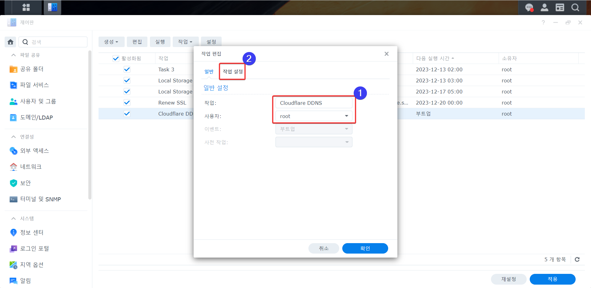
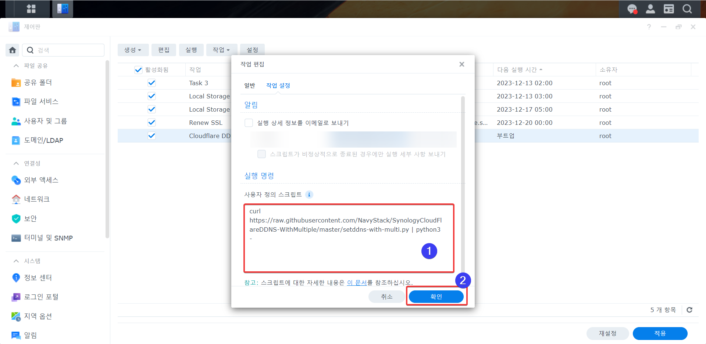
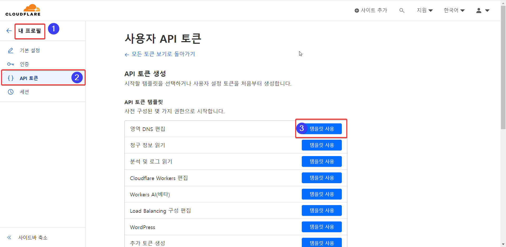
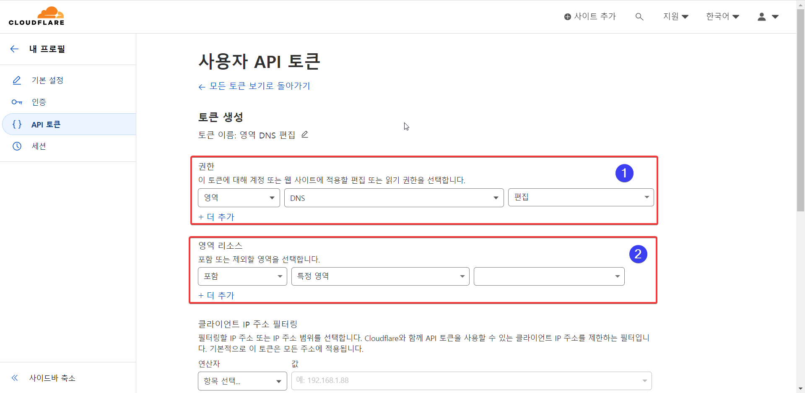
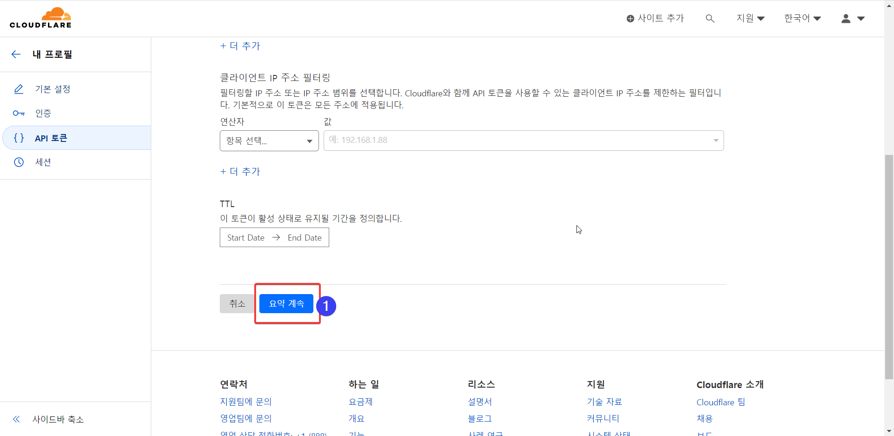

# SynologyCloudFlareDDNS <br> (시놀로지에서 Cloudflare DDNS 이용하기, 여러개 등록)

## 목적 및 특징

- 시놀로지DSM에서 클라우드플레어(Cloudflare) DDNS를 이용하기 위한 스크립트입니다.
- 최소한의 세팅이 필요합니다.
- 클라우드플레어 v4 API를 사용합니다.

## 전제조건

- 클라우드플레어에 등록된 도메인이 필요합니다.
- 클라우드플레어에 DDNS로 사용할 도메인 레코드가 등록되어 있어야 합니다.

## 설치방법 - 쉬운 방법 (DSM 7.0 이상이거나 Python3 설치필요)

1. 제어판에서 **작업 스케줄러**를 실행합니다.
   
2. **사용자 정의 스크립트**를 생성합니다.
   생성 - 트리거된 작업 - 사용자 정의 스크립트
   

```
[일반설정]
작업: Cloudflare DDNS (중요하지않음)
사용자: root
이벤트: 부트업
사전 작업: 없음
활성화됨: 체크
```



"작업 설정" - "실행명령" - "사용자 정의 스크립트" <br>

> [!TIP]
> 한개를 등록하려면
>
> ```bash
> curl https://raw.githubusercontent.com/NavyStack/SynologyCloudFlareDDNS-WithMultiple/master/setddns.py | python3 -
> ```

> [!TIP]
> 여러개를 등록하려면
>
> ```bash
> curl https://raw.githubusercontent.com/NavyStack/SynologyCloudFlareDDNS-WithMultiple/master/setddns-with-multi.py | python3 -
> ```



3. **확인**을 누릅니다.

4. 방금 생성한 작업에 **마우스 우클릭**을 합니다.

5. **실행**을 클릭합니다.

6. DDNS 목록에 **Cloudflare**가 추가된 것을 확인할 수 있습니다.

7. 시놀로지 DSM에서 DDNS 설정을 합니다. (2가지 방식 중 하나 선택)

> [!IMPORTANT]
> API Tokens 사용하기 **(권장)** <br><br>
>
> - 특정 도메인 및 권한을 최소 부여하여 유출에도 권한이 없는 영역에 접근 불가 **(보안상 이점)**<br>
> - 생성방법: Cloudflare - My Profile - API Tokens - Create Token <br> ("Edit zone DNS" 템플릿 사용, 필요한 권한: Zone - DNS - Edit)
> - Synology 설정에서 패스워드/키 칸에 생성된 API Token (40 바이트)을 입력. <br>(사용자 이름/이메일은 아무값이나 입력)

 <br><br>  <br><br> 

> [!CAUTION]
> Global API Key 사용하기 **(보안상 취약)** <br><br>
>
> - 한개의 키로 모든 권한을 가짐 <br>
> - 확인방법: Cloudflare - My Profile - API Tokens - Global API Key - View 클릭 <br>
> - Synology 설정에서 패스워드/키 칸에 확인된 Global API Key (37 바이트)를 입력하면 됩니다. <br>(사용자 이름/이메일은 Cloudflare 계정 입력)

## 설치방법 - 다른 방법(DSM 7.0 이하이거나 Python3가 설치되지 않은 경우)

1. SSH로 접속합니다. (DSM 설정에서 활성화 할 수 있습니다.)
2. 다음의 명령을 실행합니다.

```bash
sudo curl \
https://raw.githubusercontent.com/NavyStack/SynologyCloudFlareDDNS-WithMultiple/master/cloudflare.php \
-o /usr/syno/bin/ddns/cloudflare.php && \
sudo chmod 755 /usr/syno/bin/ddns/cloudflare.php
```

3. DDNS 설정 파일에 다음의 내용을 추가합니다. 마음에 드는 편집기로 수정하시기 바랍니다. _(sudo vi /etc.defaults/ddns_provider.conf)_

```php
[Cloudflare]
modulepath=/usr/syno/bin/ddns/cloudflare.php
queryurl=https://www.cloudflare.com/
```

4. 시놀로지 DSM에서 DDNS 설정을 합니다. (클라우드플레어 **Global API Key**(클라우드플레어 My Profile메뉴밑에 있음)를 비밀번호로 입력하면 됩니다.)
